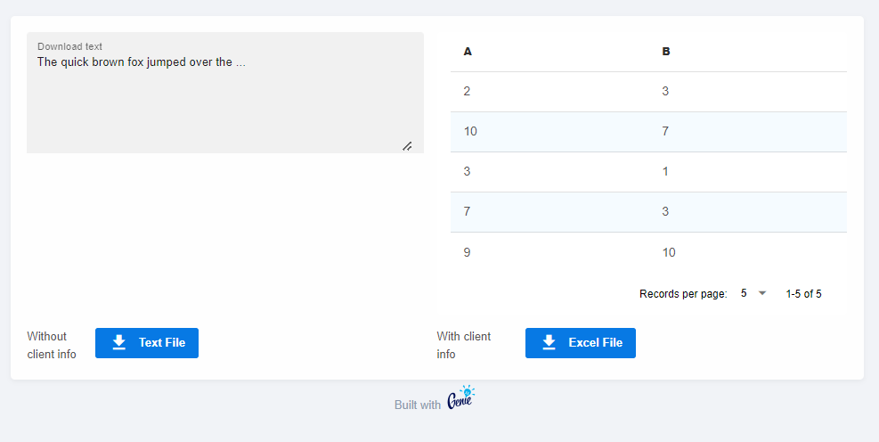

# StippleDownloads

StippleDownloads is a plugin for Stipple to enable download of dynamically generated files.
The event-based handlers guarantee that only the requesting client receives a copy of the file.

There is support for text and binary files, filenames can be freely chosen.

## Examples

**Downloading a variable's content as raw data or as BSON**

```julia
using Stipple, Stipple.ReactiveTools
using StippleUI, StippleDownloads
using BSON

@app begin
    @in data = randn(1000)

    @event download_raw begin
        download_binary(__model__, data, "raw")
    end
    @event download_bson begin
        # calling @save on `data` throws an error because it is a reactive variable. Need to make a copy
        data_var = data
        io = IOBuffer()
        BSON.@save io data_var
        seekstart(io)
        download_binary(__model__, take!(io), "data.bson")
    end

end

function ui()
    row([
            cell(btn(class="q-ml-lg", "Raw", icon="download", @on(:click, :download_raw, :addclient), color="primary", nocaps=true))
            cell(btn(class="q-ml-lg", "BSON", icon="download", @on(:click, :download_bson, :addclient), color="secondary", nocaps=true))
        ])
    
end

@page("/", ui)

```

**Downloading a DataFrame as an Excel sheet**

```julia
using Stipple, Stipple.ReactiveTools
using StippleUI
using StippleDownloads

using DataFrames
using XLSX

import Stipple.opts
import StippleUI.Tables.table

# build a function `writetable()` that writes to IO (PR currently pending)
function writetable(io::IO, tables::Union{Vector, Tuple}; kwargs...)
    XLSX.openxlsx(io, mode="w") do xf
        for (i, table) in enumerate(tables)
            table isa Pair || (table = nothing => table)
            if i == 1
                table[1] !== nothing && XLSX.rename!(xf[1], table[1])
            else
                table[1] === nothing ? XLSX.addsheet!(xf) : XLSX.addsheet!(xf, table[1])
            end
            XLSX.writetable!(xf[i], table[2]; kwargs...)
        end
    end
end

writetable(io::IO, tables; kwargs...) = writetable(io, [tables]; kwargs...)
writetable(io::IO, tables...; kwargs...) = writetable(io, tables; kwargs...)

function df_to_xlsx(df)
    io = IOBuffer()
    writetable(io, df)
    take!(io)
end

@app begin
    @out table = DataTable(DataFrame(:a => rand(1:10, 5), :b => rand(1:10, 5)))
    @in text = "The quick brown fox jumped over the ..."

    @event download_text begin
        download_text(__model__, :text)
    end

    @event download_df begin
        try
            download_binary(__model__, df_to_xlsx(table.data), "file.xlsx"; client = event["_client"])
        catch ex
            println(ex)
        end
    end
end

function ui()
    row(cell(class = "st-module", [

        row([
            cell(textfield(class = "q-pr-md", "Download text", :text, placeholder = "no output yet ...", :outlined, :filled, type = "textarea"))
            cell(table(class = "q-pl-md", :table))
        ])
              
        row([
            cell(col = 1, "Without client info")
            cell(btn("Text File", icon = "download", @on(:click, :download_text), color = "primary", nocaps = true))
            cell(col = 1, "With client info")
            cell(btn(class = "q-ml-lg", "Excel File", icon = "download", @on(:click, :download_df, :addclient), color = "primary", nocaps = true))
        ])
    ]))
end

@page("/", ui)

up(open_browser = true)

```

To see the difference between calling with or without client info, duplicate the applications's tab and click the 'Download Text' button.

Two identical files will be downloaded, because duplicating the tab establishes a synchronised copy of your app. To ensure that only the requesting client receives a file, you should include the client info via `event["_client"]`.
    

